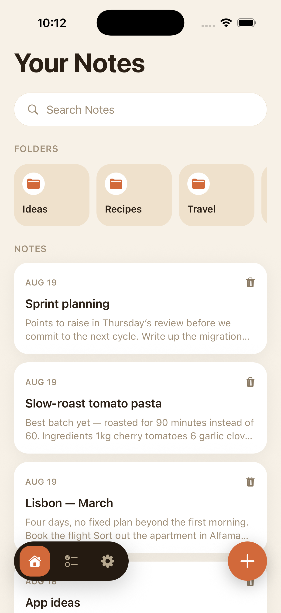
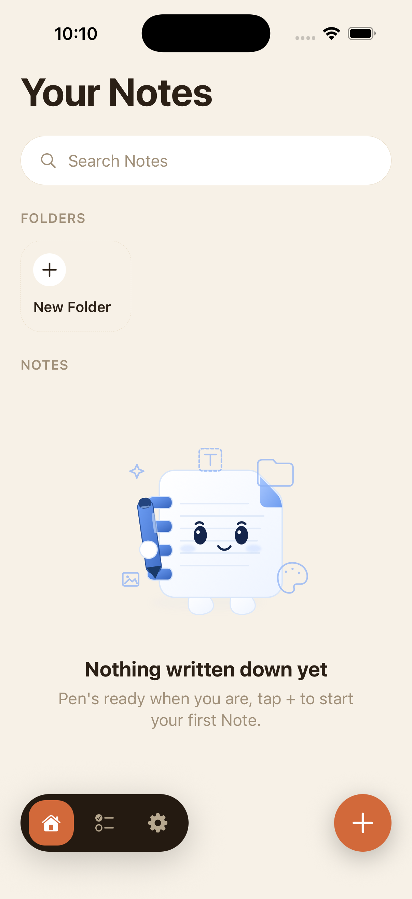
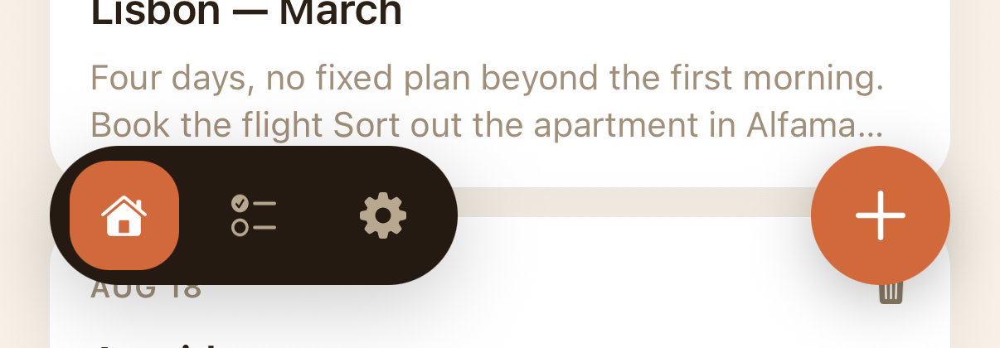
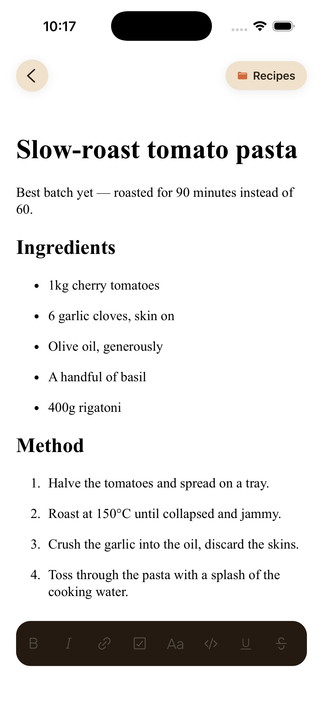
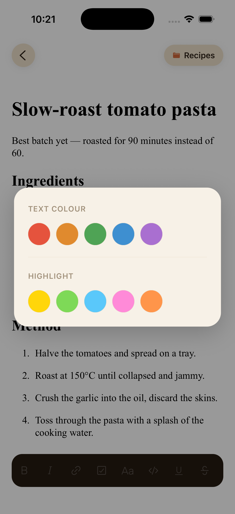
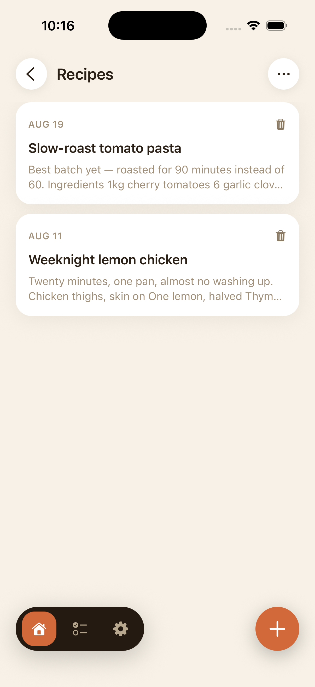
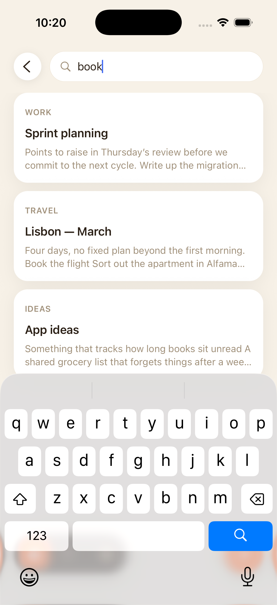
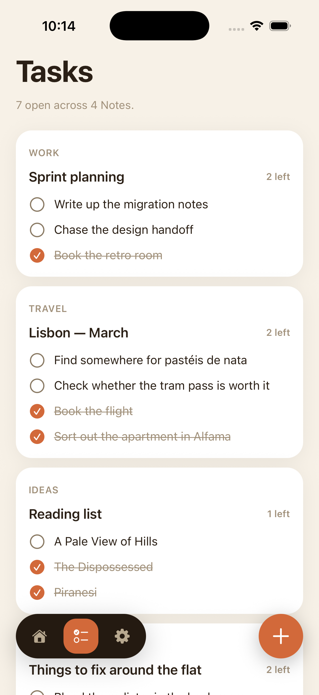
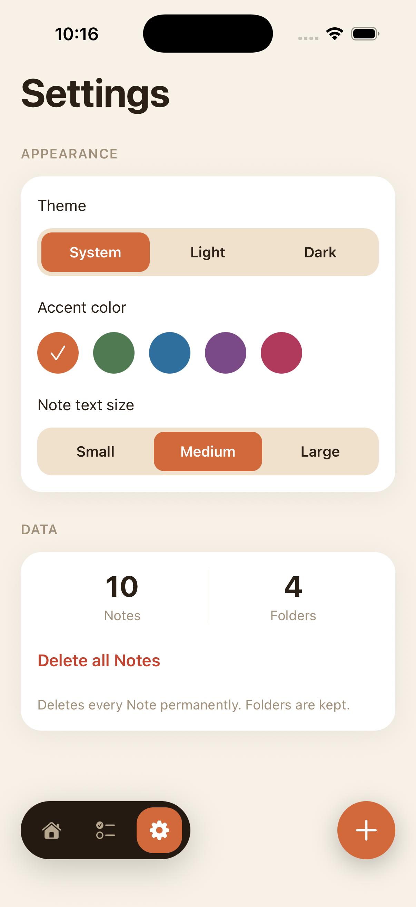
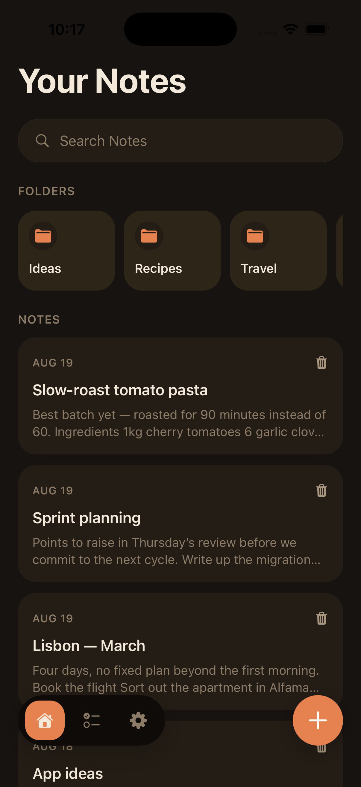

# NotesApp

A local-first, cross-platform (iOS + Android) note-taking app built with Expo and React Native.

Create, format, and organise rich-text notes entirely on your device. There are no accounts, no server, and no sync — every note lives in a local SQLite database and nothing ever leaves the phone. Notes take their title from their first line (Apple Notes-style), group into flat folders, and are searchable the moment you start typing. Any checklist you write inside a note also appears in a dedicated **Tasks** screen, so to-dos scattered across a dozen notes can be seen and ticked off in one place.

---

## Table of contents

- [Installation & running](#installation--running)
- [Features](#features)
- [Screenshots](#screenshots)
- [Technologies used](#technologies-used)
- [Architecture](#architecture)
- [Testing](#testing)
- [Known issues & future improvements](#known-issues--future-improvements)
- [Reflection on the process](#reflection-on-the-process)

---

## Installation & running

### ⚠️ Requires a custom Dev Client — Expo Go will not work

This app depends on a native module (`@10play/tentap-editor`, for rich-text editing) that isn't available in the plain Expo Go sandbox. You must build and run a [custom Expo Dev Client](https://docs.expo.dev/develop/development-builds/introduction/).

### Prerequisites

| Platform | Requirements |
|---|---|
| iOS | macOS, Xcode, CocoaPods |
| Android | Android Studio / SDK, a JDK |
| Both | Node.js 18+, npm |

### Steps

**1. Install dependencies**

```bash
npm install
```

**2. Generate the native iOS/Android projects**

```bash
npx expo prebuild
```

Required at least once, and again any time native config (`app.json` plugins, native dependencies) changes. `ios/` and `android/` are gitignored — they're regenerated, not hand-edited.

**3. Build and launch the dev client**

```bash
npx expo run:ios       # builds, installs to a simulator/device, starts Metro
npx expo run:android
```

On subsequent runs, once the dev client is installed:

```bash
npx expo start         # reconnects Metro to the installed dev client
```

You only need to rebuild natively again if native config changes.

### Other commands

```bash
npm test               # run the unit test suite (Jest)
npm run lint           # ESLint via expo lint
npm run db:generate    # regenerate Drizzle migrations after a schema change
```

---

## Features

### Notes

- **Autosave, no save button.** Edits persist on a short debounce; a status indicator in the header shows saving / saved / failed so you always know where your work stands.
- **Derived titles.** A note has no title field — it takes the first non-blank line of its content, so nothing has to be named manually.
- **Blank notes discard themselves.** Open a new note, type nothing, navigate away, and it's never persisted. Type into one and delete it all back down, and it's removed.
- **Rich-text formatting.** Headings (6 levels), bold, italic, underline, strikethrough, inline code, blockquote, bulleted and numbered lists, checklists, links, indent/outdent, undo/redo — all WYSIWYG, no markdown syntax to learn.
- **Text colour and highlighting.** A curated palette of colours chosen to stay legible in both light and dark themes. Highlights are translucent, so they tint the text background instead of replacing it. Tap the applied colour again to remove it.
- **Permanent deletion, with confirmation.** There is no trash and no undo (see [ADR-0003](docs/adr/0003-hard-delete-no-trash.md)) — so every delete is gated by a confirmation dialog and a warning haptic.

### Organisation

- **Flat folders.** Create, rename, and delete named folders. A note belongs to at most one, or to none ("Unfiled").
- **Deleting a folder never deletes notes.** Its notes move to Unfiled instead, in a single transaction.
- **Context-aware note creation.** A note created inside a folder is filed there automatically; one created from Home starts Unfiled.
- **Move between folders** from the note editor at any time.

### Search

- **Global live search** across every note's title and body, filtering as you type, regardless of folder.
- Each result shows which folder it came from.
- Search runs against notes already in memory, so there's no query round trip, no debounce, and no chance of stale results arriving out of order.

### Tasks

- **A rollup of every checklist item** in every note, grouped by the note holding it, with its folder for context.
- **Ticking an item is a real edit** to its note — it updates that note's content and its last-edited time.
- **The list holds still while you use it.** Ticking an item doesn't reorder the list under your finger; it re-sorts the next time you open the screen.

### Settings

- **Theme:** System / Light / Dark.
- **Accent colour:** five options, each with light and dark variants tuned for legibility.
- **Note text size:** small / medium / large, applied inside the editor.
- **Data:** live note and folder counts, plus "delete all notes" (which leaves folders standing).
- All preferences apply instantly with no "apply" step and survive a restart.

### Interface

- **Tab navigation** between Home, Tasks, and Settings, drawn as a custom floating pill. Each tab keeps its own scroll position and its own nested history.
- **Collapsing header** on Home — the title and folders scroll away while the search bar pins to the top and stays reachable.
- **Illustrated empty states** with the app mascot instead of a bare line of text.
- **Animated note opening** — the editor expands out of the "+" button you tapped.
- **Haptic feedback** on checklist toggles, note creation, preference changes, and destructive actions.
- **Accessibility:** screen-reader labels throughout, radio-group semantics on pickers, modal isolation, and Reduced Motion support (animations are skipped entirely when it's enabled).

---

## Screenshots

| Screen | Preview | What it shows |
|---|---|---|
| **Home** |  | Note list, folder strip, search bar, floating navigation |
| **Home (empty)** |  | Mascot illustration and empty-state copy |
| **Navigation** |  | The floating tab pill and "+" button |
| **Note editor** |  | Rich-text editing, the formatting toolbar, and the note's folder pill |
| **Colour picker** |  | Text colour and highlight sheet |
| **Folder** |  | Browsing a single folder's notes |
| **Search** |  | Live filter-as-you-type results with folder context |
| **Tasks** |  | Checklist rollup grouped by note |
| **Settings** |  | Theme, accent, text size, and data controls |
| **Dark mode** |  | The same app in the dark palette |

All captures are from an iPhone 17 Pro simulator running the app against a live Metro bundler.

---

## Technologies used

### Framework & platform

| Technology | Version | Purpose |
|---|---|---|
| [Expo](https://expo.dev) | SDK 54 | Build tooling, native module management, dev client |
| [React Native](https://reactnative.dev) | 0.81.5 | Cross-platform UI, New Architecture enabled |
| [React](https://react.dev) | 19.1 | Component model, `useReducer`/Context state |
| [TypeScript](https://www.typescriptlang.org) | 5.9 | Strict mode throughout |

### Navigation

| Technology | Purpose |
|---|---|
| [Expo Router](https://docs.expo.dev/router/introduction/) 6 | File-based routing, typed routes |
| [React Navigation](https://reactnavigation.org) 7 | Bottom tabs (with a custom `tabBar`) and native stacks |
| `react-native-screens` | Native screen primitives and transitions |

### Data & persistence

| Technology | Purpose |
|---|---|
| [`expo-sqlite`](https://docs.expo.dev/versions/latest/sdk/sqlite/) | On-device SQLite database |
| [Drizzle ORM](https://orm.drizzle.team) | Type-safe schema, queries, and migrations |
| `drizzle-kit` | Migration generation |

Three tables — `notes`, `folders`, `settings` — with two applied migrations.

### Editor

| Technology | Purpose |
|---|---|
| [`@10play/tentap-editor`](https://github.com/10play/10tap-editor) | Rich-text editor (TipTap/ProseMirror in a WebView) |
| `react-native-webview` | Host for the editor document |

### UI & interaction

| Technology | Purpose |
|---|---|
| [`react-native-reanimated`](https://docs.swmansion.com/react-native-reanimated/) 4 | Collapsing header, open animation, all UI-thread animation |
| `react-native-safe-area-context` | Safe-area-aware layout |
| `expo-haptics` | Tactile feedback |
| `expo-image` | Mascot SVG rendering |
| `@expo/vector-icons` / `expo-symbols` | Iconography (SF Symbols on iOS) |

### Testing & tooling

| Technology | Purpose |
|---|---|
| [Jest](https://jestjs.io) + `jest-expo` | Unit test runner |
| `better-sqlite3` | In-memory database for repository tests |
| ESLint (`eslint-config-expo`) | Linting |

---

## Architecture

```
app/                      Screens (Expo Router file-based routes)
  (tabs)/                   Tab navigator
    (home)/                   Home tab's own stack: list, folder, search
    tasks.tsx  settings.tsx
  note/[id].tsx             Editor, pushed above the tabs

components/               Presentational components
hooks/                    Store access, theming, shared screen behaviour
lib/                      Pure domain logic — no React, no database
db/                       Schema, migrations, repositories
docs/adr/                 Architecture decision records
```

Data flows in one direction:

```
SQLite → repositories → NotesStore (useReducer + Context) → selectors → screens
```

Every write goes through the store, which persists via the repository and folds the result into shared state. Because there is one copy of the data, an edit made anywhere is visible everywhere immediately — no screen re-fetches on focus, and derived views (search results, the tasks rollup, settings counts) are computed from that state rather than queried.

The design decisions are recorded as ADRs:

| ADR | Decision |
|---|---|
| [0001](docs/adr/0001-expo-sqlite-and-drizzle-for-local-storage.md) | `expo-sqlite` + Drizzle, not WatermelonDB or Realm |
| [0002](docs/adr/0002-tentap-for-rich-text-editing.md) | TenTap for rich-text editing |
| [0003](docs/adr/0003-hard-delete-no-trash.md) | Notes are hard-deleted; there is no trash |
| [0004](docs/adr/0004-shared-notes-store-over-per-screen-fetching.md) | One shared store, not per-screen state refetched on focus |
| [0005](docs/adr/0005-tabs-for-the-three-destinations.md) | Real tab navigation with a custom tab bar |

[`CONTEXT.md`](CONTEXT.md) defines the project's domain vocabulary and its settled product behaviours.

---

## Testing

```bash
npm test
```

**138 tests across 9 suites**, covering the layers where correctness is decided:

| Suite | Covers |
|---|---|
| `lib/notes/store` | State transitions and every selector |
| `lib/notes/autosave` | When to create, update, delete, or do nothing |
| `lib/notes/rich-text` | Document ↔ plain-text projection, title derivation |
| `lib/notes/search` | Match predicate and folder attribution |
| `lib/notes/tasks` | Checklist extraction, toggling, display ordering |
| `lib/preferences` | Parsing and defaulting stored preferences |
| `db/repository` | CRUD against a real in-memory SQLite database |
| `db/settings-repository` | Preference persistence |
| `db/client` | Migration smoke test |

The strategy is deliberate: the domain logic and the database seam are pure and fully covered, while UI rendering is verified by hand. See [Known issues](#known-issues--future-improvements) for the gap this leaves.

---

## Known issues & future improvements

### Known issues

- **The whole notes library is held in memory.** This is what makes search instant and edits propagate everywhere without refetching, but it doesn't scale indefinitely. It's the first assumption to revisit if a user's library ever grew very large. ([ADR-0004](docs/adr/0004-shared-notes-store-over-per-screen-fetching.md))
- **Search is a full in-memory scan.** Note content is a serialised rich-text document, opaque to SQL ([ADR-0001](docs/adr/0001-expo-sqlite-and-drizzle-for-local-storage.md)), so there's no index to use. Fine at realistic sizes; linear in the number of notes.
- **No UI or end-to-end tests.** Every test covers pure logic or the database. Rendering, navigation, and gestures are verified manually, so visual regressions aren't caught automatically.
- **The mascot doesn't follow the accent colour.** It's rendered as an SVG through `expo-image`, whose `tintColor` only applies to template images. Recolouring per-accent would mean inlining the paths with `react-native-svg`.
- **Text colours are a compromise.** A colour chosen in a note is stored in the document, so it outlives the theme it was picked under. The palette is restricted to mid-tones that stay legible on both light and dark editor surfaces.
- **Requires a custom dev client.** The editor's native module rules out Expo Go.
- **No landscape or tablet-specific layout.** Layouts adapt to screen size, but the interface is designed for portrait phones.

### Future improvements

- **Images in notes.** Investigated and deferred. Doing it properly needs file storage rather than inline base64 (which would defeat the in-memory store), relative-path rewriting to survive iOS container changes between builds, an orphan-file sweep, and WebView `file://` access. Roughly a week's work, and it changes the blank-note discard rule — an image-only note has no text, so it would currently delete itself.
- **Tables in the editor.** TenTap ships a pre-compiled 540 KB WebView bundle, and only CSS and a config map are injected at runtime — so no new TipTap extension can be added without vendoring and rebuilding that bundle, then maintaining the fork. Tables would also need their own row/column UI and teaching search about table nodes.
- **Drawing and shapes.** Both depend on the image pipeline above; shapes additionally mean authoring a custom ProseMirror node with selection and resize handles.
- **Pinned notes and sort options.** Both are natural extensions of the store — a schema column and a reducer action for pinning, a pure selector for sorting.
- **Swipe-to-delete** on note cards, replacing the always-visible trash icon (`react-native-gesture-handler` is already a dependency).
- **A closing animation** to mirror the note-opening one.
- **Dynamic Type support** end to end — layouts measure where it matters, but font sizes are currently fixed.

---

## Reflection on the process

Three decisions shaped this project more than the rest.

**Domain logic was kept out of React from the start.** `lib/` contains no components and no database access — just functions over plain data: when to autosave, how to project a document to plain text, how to extract and toggle checklist items, how the state reducer transitions. That's why 138 tests run in about a second with no renderer and no mocking, and it's what made later refactors safe rather than nerve-wracking.

**The biggest refactor was replacing per-screen state with one shared store.** Originally every list screen kept its own `useState` copy of the notes it displayed and re-fetched on focus, because that was the only way a screen could hear about an edit made in the editor. The cost was five copies of the same data that could disagree, five reload paths, and three hand-written guards against stale responses arriving out of order. Consolidating into one `useReducer` store deleted all of that, and made several features fall out almost free: search became a pure derivation rather than a query, and the tasks rollup and settings counts became one-line selectors. It also had a consequence I didn't anticipate — it's what made real tab navigation safe, because screens that stay mounted across tab switches would otherwise have stayed stale.

**Several features were investigated and deliberately not built.** Images, tables, drawing, and a NativeWind migration were each scoped properly before being declined. Finding out that TenTap's editor bundle is pre-compiled — so no new extension can reach inside it without maintaining a fork — was worth more than a half-finished tables feature would have been. Writing those findings down in the section above is part of the work, not an admission of failure.

If I were starting again, I'd build the shared store first. Almost everything awkward in the middle of this project traced back to state being owned in the wrong place.
